# Colab

Platform for analyzing and managing collaborations between advertisers and content creators.

Colab is the graduation project (PFE) of **Bechir Guerriche** and **Salah Gnaoui**, developed at the Higher Institute of Technological Studies of Zaghouan (ISET Zaghouan), Department of Information Technologies, specialty Information Systems Development. The internship ran from **29 January 2025** to **31 May 2025**, academic year **2024/2025**, with the aim of obtaining the Degree in Computer Technology.

| | |
|---|---|
| PFE code | DSI75 |
| Academic supervisor | Mrs. Yosra Kassis |
| Company supervisor | Mr. Mohamed Ali Elloumi, CEO of ACCESS |
| Internship supervisor | Mr. Mohamed Neji Bouzid, COO at ACCESS |
| Host company | [ACCESS Group](https://www.access.tn/) |
| Stack | React, Node.js, Express, MongoDB (MERN) |

<p>
  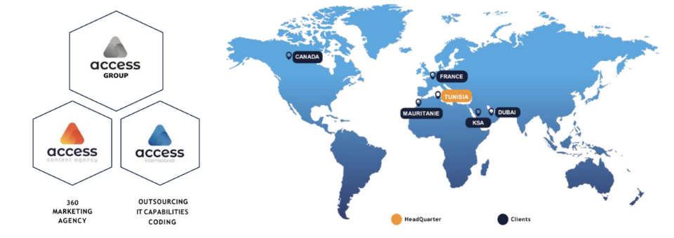
</p>

The specification behind the product is the cahier des charges **PFEDV08** (version 1.0.0, 4 February 2025, responsible Mohamed Ali Elloumi). This repository is the implemented platform described in the final report.

The figures below are taken from that report.

### Sign-up

A visitor chooses Influencer or Brand, then fills the role-specific form. Creators enter their Instagram and TikTok usernames before the account is verified by email.

<p>
  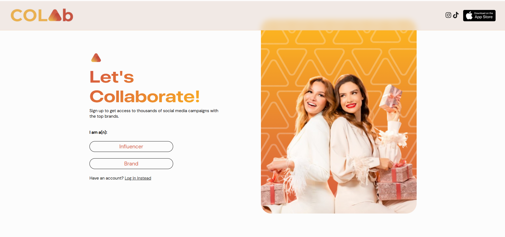
</p>
<p>
  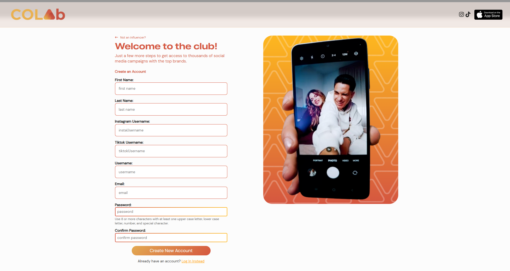
</p>

### Brand workspace

The brand dashboard lists briefs with budget, deadline, and assignment status. Opening a brief shows categories, platform, and the reference sheet. The Campaigns tab collects the videos creators submitted.

<p>
  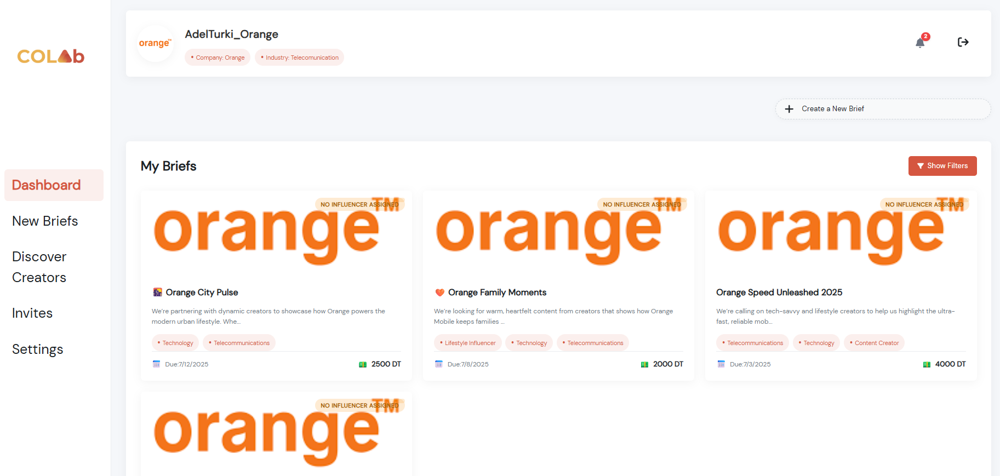
</p>
<p>
  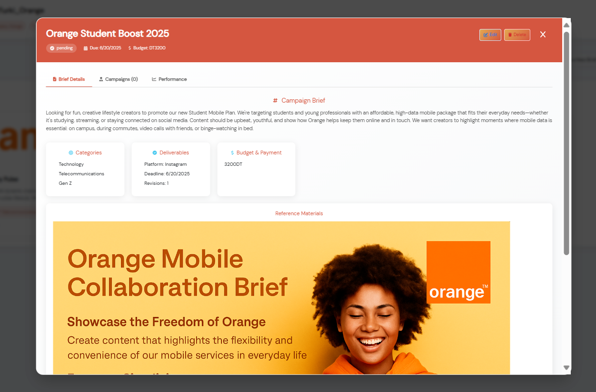
</p>
<p>
  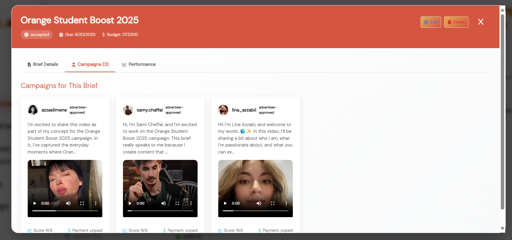
</p>
<p>
  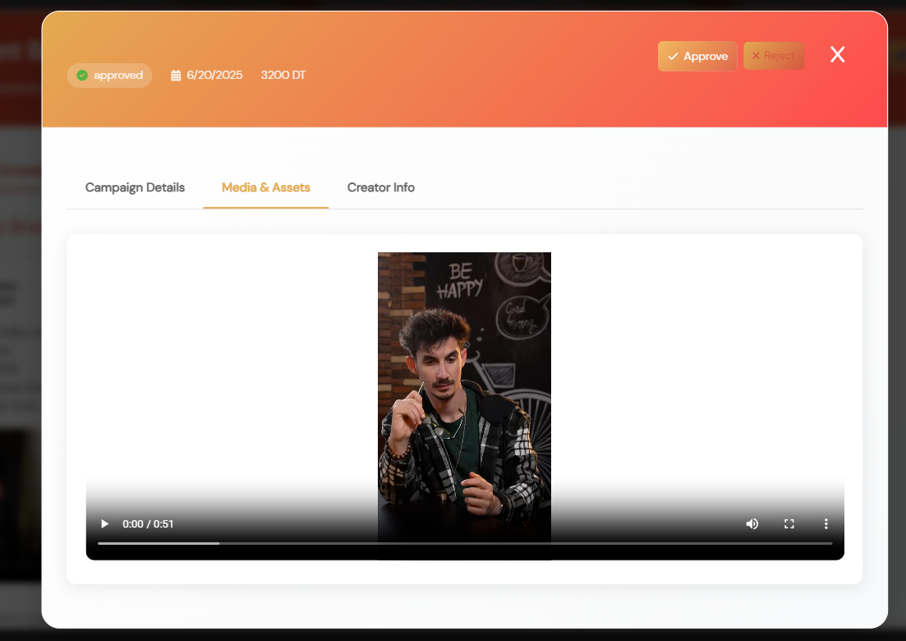
</p>

### Creator search

Brands filter creators by name, bio, or category and compare follower counts with the score out of 100.

<p>
  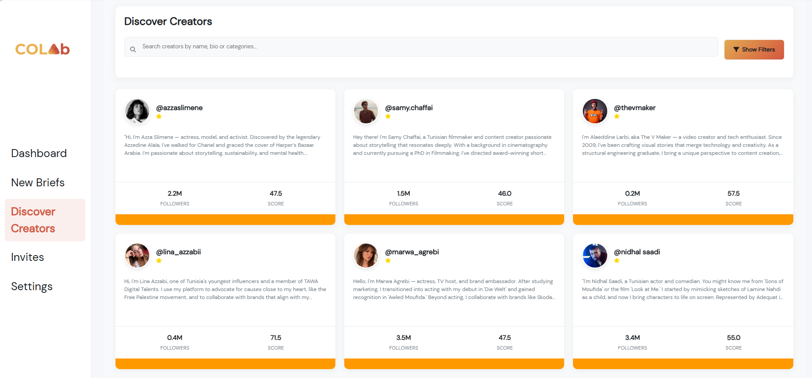
</p>

## 1. Why Colab exists

Social platforms such as Instagram, TikTok, and YouTube changed how brands reach an audience. User-generated content is more authentic than classic advertising, so companies increasingly work with creators. At ACCESS International that work was still manual.

A campaign request arrived by email, phone, or even a verbal brief. An internal team turned the goals into informal criteria, then searched personal contact lists and public profiles. Outreach happened one person at a time over phone, WhatsApp, or direct message. Deliverables were exchanged by email or shared links, and status lived in spreadsheets and notes.

That workflow has a personal touch, and it can carry a small campaign. It does not scale:

- Finding and contacting creators takes too much time.
- Profiles, briefs, and results are scattered across inboxes and files.
- There is no structured way to measure what a campaign actually did.
- There is no objective score, so the team cannot rank creators by performance.
- More campaigns means more delays and more mistakes.

Colab puts the whole path in one place: a brand writes a brief, a creator applies with a campaign, an administrator moderates, and a score helps the brand choose. The report describes it as a smarter way to collaborate in the creator economy.

### Position against existing tools

The study compared Colab’s context with tools already on the market:

| Platform | Strengths | Weaknesses |
|---|---|---|
| Upfluence / Heepsy | Large creator database, niche filters, campaign tracking | High subscription cost, limited customization, no AI scoring |
| CreatorIQ / Tagger | Strong analytics, reporting, brand collaboration | Complex interface, training required, costly for a small agency |
| Tawa Digital | Tunisian influencer management, cross-platform, friendly interface | Smaller user base, limited third-party integrations, unclear pricing |
| Manual process at ACCESS | Personal follow-up | No automation, no central database, no scoring |

Colab is aimed at that gap: a customizable workflow for ACCESS, with briefs, campaigns, moderation, and a score out of 100.

## 2. What the platform does

### Actors

- **Guest.** Visits the homepage and creates a Brand or Creator account. The account stays inactive until the email verification code is confirmed.
- **Brand (advertiser).** Writes briefs, searches creators, reviews campaigns submitted against those briefs, and accepts or rejects them.
- **Creator.** Browses briefs, expresses interest, submits a campaign (concept plus optional media), and follows score and campaign status.
- **Administrator.** Verifies, suspends, or deletes accounts, moderates briefs and campaigns, manages categories, and reads platform counts.
- **Scoring system.** A secondary actor. It collects public social data and turns it into a score brands can use when they choose a creator.

### Functional scope

**Guest**

- Open the public homepage.
- Register as a Brand or a Creator.
- Confirm the account with the verification code sent by email.

**Shared by Brand and Creator**

- Log in and log out.
- Update and consult a profile (photo, bio, social handles, categories, company details for a brand).
- Receive in-platform notifications.
- Open a role-specific dashboard.

**Brand**

- Create, update, delete, and list its own briefs.
- Browse every brief on the platform.
- Search creators by name, category, platform, and score.
- Open the campaigns attached to a brief.
- Accept or reject a submitted campaign.
- Follow brief status from the dashboard.

**Creator**

- Browse available briefs and express interest.
- Create, update, delete, and consult campaigns.
- Attach media to a campaign.
- Read the social score built from scraped metrics and a qualitative evaluation.

**Administrator**

- Manage creators and advertisers (verify, suspend, delete).
- Change brief validation status (`pending`, `accepted`, `rejected`).
- Change campaign status.
- Add and delete categories used to classify creators and briefs.
- Read counts of briefs, campaigns, creators, and advertisers.

A brief is the announcement of a collaboration: title, description, objectives, categories, phrases, tags, budget, deadline, review deadline, target platform (Instagram or TikTok), and an optional attachment. A campaign is the creator’s answer to that brief: description, media, and a status the brand or the admin can approve or reject.

### Non-functional requirements

- **Security.** Login issues a signed token. The API checks the token and the role (`Admin`, `Brand`, or `Influencer`) before a protected action. Passwords are hashed with bcrypt. Verification codes expire. Transfers are expected over HTTPS in production. The token is stored in an HTTP-only cookie.
- **Email verification.** A Brand or Creator cannot log in before the account is verified. This limits fake accounts.
- **Usability.** Brief creation and campaign submission are form flows, not a collection of separate tools.
- **Performance.** The target for posting a brief, submitting a campaign, or reading a status is under two seconds.
- **Availability and privacy.** The interface is built for desktop use. Profile data is shared only where a collaboration needs it.
- **Least privilege.** Each role only sees the screens and records that role is allowed to change.

## 3. Scoring

The cahier des charges splits the global score into a quantitative part (40%) and a qualitative part (60%). The implemented model, described in chapter 5 of the report, expresses the same split as points out of 100.

**Quantitative score, 40 points**, computed in Node.js from scraped profile and post data:

| Criterion | Points | What it measures |
|---|---|---|
| Audience | 15 | Follower count, growth, and follower quality, normalized against a benchmark (the report uses 1 million followers as the reference) |
| Engagement | 15 | Average likes and comments per post divided by followers, plus comment richness and how fast interactions arrive |
| Regularity | 10 | Posting frequency and consistency. A steady interval scores higher than bursts separated by long silences |

**Qualitative score, 60 points**, interpreted from captions and metadata:

| Criterion | Points | What it measures |
|---|---|---|
| Content quality | 20 | Visual quality, editing, creativity, audio, lighting, storytelling |
| Expertise and authority | 15 | Demonstrated knowledge, collaborations, awards, credibility in the niche |
| Influence and impact | 15 | Comment quality, ability to start a conversation, influence on behavior |
| Professionalism and branding | 10 | Visual consistency, clear message, readiness for partnerships |

The report specifies OpenAI GPT-3.5-turbo, with prompts written in French, one prompt per qualitative dimension. The code in this repository evaluates those same four dimensions through a local model served by [Ollama](https://ollama.com/) (`llama3`). If Ollama is not running, each qualitative criterion falls back to 0 and the quantitative part still stands.

### What the scraper collects

`backend-main/utils/scrapeInstagram.js` requests public Instagram profile data with `node-fetch`. It does not log into Instagram. From a profile it keeps username, follower count, following count, biography, profile picture URL, and verified status. From the latest 12 to 24 posts it keeps likes, comments, caption, timestamp, thumbnail URL, and an engagement ratio. That JSON feeds both scoring modules. Official Instagram Graph API and TikTok for Business API integration, including OAuth and rate-limit handling, is listed in the conclusion as future work.

## 4. How the project was run

The team used Scrum. Each sprint lasted about four weeks and ended with a usable increment.

<p>
  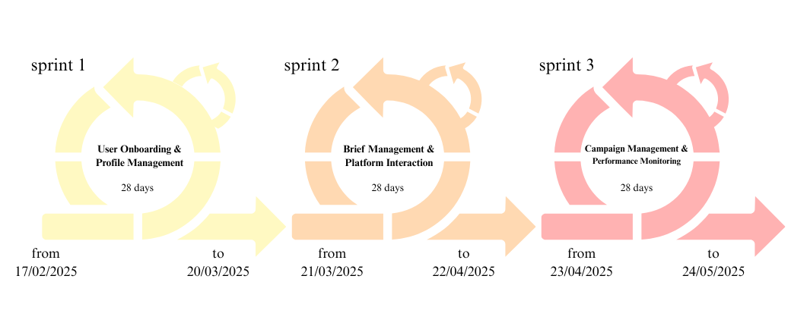
</p>
<p>
  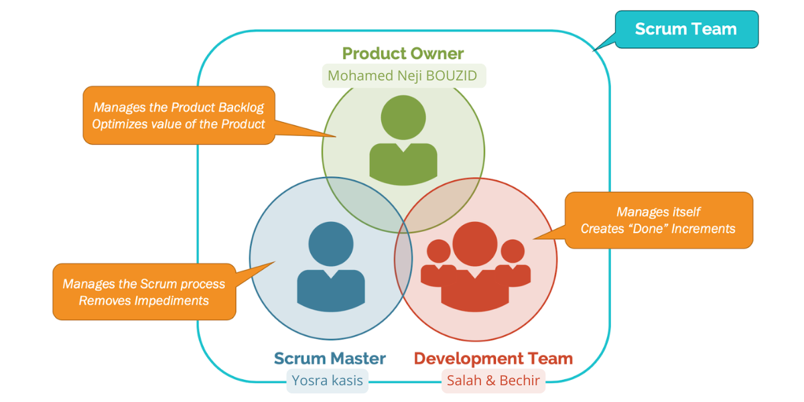
</p> Roles were Product Owner, Scrum Master, and the development team. Events were sprint planning, daily stand-up, sprint review, and retrospective. Requirements were modeled in UML (use cases, classes, sequences) with StarUML and diagrams.net.

Story points follow the Fibonacci scale. Priority is High or Medium.

### Product backlog

| ID | Feature | Story | Priority | Points |
|---|---|---|---|---|
| 1.1 | Authentication | As a visitor, I can access the home page | Medium | 3 |
| 1.2 | Authentication | As a user, I want to sign up and receive a verification code and a welcome email | High | 21 |
| 1.3 | Authentication | As a user, I want to log in | High | 8 |
| 1.4 | Authentication | As a user, I want to log out | High | 3 |
| 1.5 | Authentication | As a user, I want to reset my password by email | High | 5 |
| 2.1 | Profile | As a user, I want to update my profile | High | 21 |
| 2.2 | Profile | As a user, I can consult my profile | High | 8 |
| 2.3 | Profile | As a brand, I can search creator profiles | High | 13 |
| 3.1 | Briefs | As a brand, I want to create briefs that define the collaboration | High | 13 |
| 3.2 | Briefs | As a brand, I can update my brief | Medium | 8 |
| 3.3 | Briefs | As a brand, I can delete my brief | Medium | 5 |
| 3.4 | Briefs | As a brand, I can consult my own briefs | Medium | 8 |
| 3.5 | Briefs | As a user, I can consult all briefs | High | 8 |
| 3.6 | Briefs | As a creator, I can express interest in a brief | Medium | 8 |
| 3.7 | Briefs | As a creator, I can apply to a brief | High | 13 |
| 4.1 | Campaigns | As a creator, I can create campaigns | High | 13 |
| 4.2 | Campaigns | As a creator, I can delete campaigns | Medium | 5 |
| 4.3 | Campaigns | As a creator, I can update campaigns | Medium | 5 |
| 4.4 | Campaigns | As a creator, I can consult my campaigns | Medium | 5 |
| 4.5 | Campaigns | As a brand, I can consult campaigns related to my briefs | High | 13 |
| 4.6 | Campaigns | As a brand, I can accept or reject those campaigns | High | 8 |
| 5.1 | Scoring | As a creator, I can consult scores scraped from Instagram and TikTok | High | 21 |
| 6.1 | Notifications | As a user, I want notifications so I stay informed | High | 8 |
| 7.1 | Admin | As an admin, I can manage users | High | 13 |
| 7.2 | Admin | As an admin, I can manage categories | High | 8 |
| 7.3 | Admin | As an admin, I can change campaign status | High | 13 |
| 7.4 | Admin | As an admin, I can change brief status | High | 13 |
| 7.5 | Admin | As an admin, I can view collaboration statistics | Medium | 8 |
| 8.1 | Dashboards | As a brand, I can consult brief statistics and performance | High | 8 |
| 8.2 | Dashboards | As a creator, I can consult campaign performance and status | High | 8 |

### Sprints

**Sprint 1 — User onboarding and profile management**  
17 February 2025 – 20 March 2025. Stories 1.1–1.5, 2.1–2.3, 7.1, 7.2. About 103 points, estimated at 28 days.

Delivered the homepage, sign-up with a 6-digit verification code, login, logout, password reset, profile update and consultation, creator search, and the admin tables for users and categories. Each story went through interface design, backend, frontend integration, then test. Signup creates the `User` document and, depending on the role, an `Advertiser` or `Creator` document that shares the same id. Login compares the bcrypt hash, refuses unverified accounts, and sets the cookie.

**Sprint 2 — Brief management and platform interaction**  
21 March 2025 – 22 April 2025. Stories 3.1–3.7, 6.1, 7.4, 8.1. 92 points, 28 days.

Delivered the brief lifecycle. A brand creates a brief (title, description, categories, budget, deadlines, platform, optional file). Creators browse briefs and apply. Brands see their own briefs on the dashboard, with filters by title, category, status, and sort. Admins accept or reject a brief. Status changes create notifications. The brand dashboard is the performance view for this sprint.

**Sprint 3 — Campaigns, scoring, notifications, creator dashboard**  
23 April 2025 – 24 May 2025. Stories 4.1–4.6, 5.1, 7.3, 7.5, 8.2. 99 points, 28 days.

A creator can open an accepted brief and submit a campaign: description, optional video or image, then a confirmation step. The creator dashboard lists those campaigns with title, description, due date, and status. A brand opens the brief and approves or rejects each submission. An admin sees every campaign in one table and can approve, reject, or delete. Deleting a campaign also removes its media. Refreshing a score re-reads Instagram data, recomputes the quantitative and qualitative parts, and stores the total on the `Score` document linked to the creator.

### Development machines

| | Asus TUF Gaming FX506HF | Asus VivoBook 15 |
|---|---|---|
| CPU | Intel Core i5-11400H (6 cores / 12 threads, up to 4.5 GHz) | AMD Ryzen 5 7520U (4 cores / 8 threads, up to 4.3 GHz) |
| GPU | NVIDIA GeForce RTX 2050, 4 GB GDDR6 | Integrated AMD Radeon |
| RAM | 16 GB DDR4 | 16 GB DDR4 |
| Disk | 512 GB NVMe SSD | 512 GB SSD |
| OS | Windows 11 | Windows 11 |

Modeling and editing tools named in the report: Visual Studio Code, StarUML, diagrams.net, Canva, Git, and GitHub.

## 5. Architecture

The logical architecture is MVC.

- **Model.** Mongoose schemas in `backend-main/models`: `User`, `Advertiser`, `Creator`, `Brief`, `Campaign`, `Score`, `Notification`, `Payment`, `Category`.
- **View.** React pages and components in `frontend-main/src`, styled with Sass.
- **Controller.** Express route handlers in `backend-main/controllers`, reached through `backend-main/routes`.

<p>
  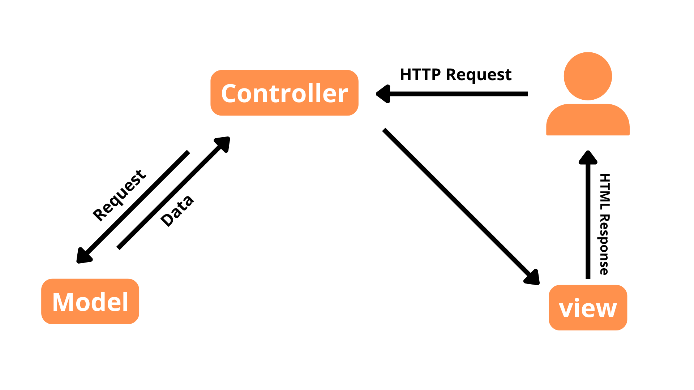
</p>
<p>
  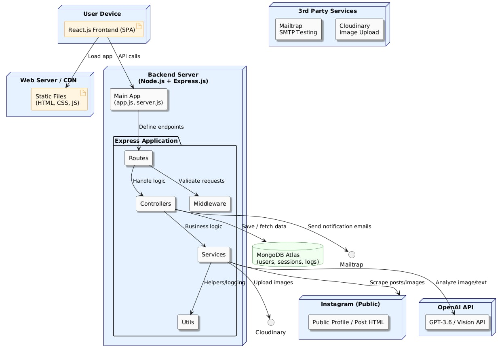
</p>
<p>
  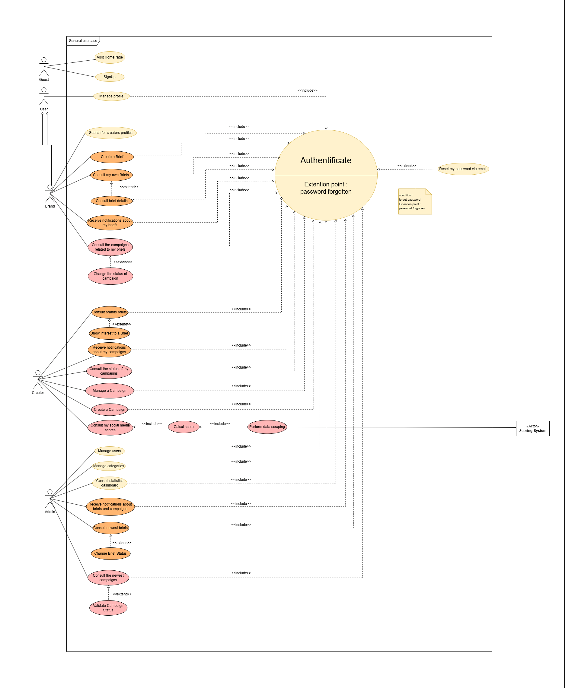
</p>
<p>
  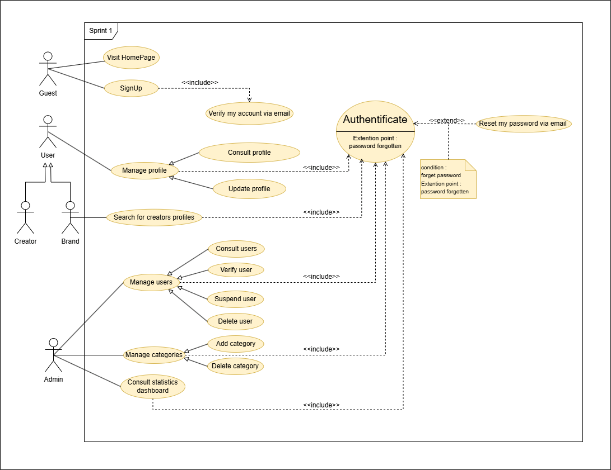
</p>

Physically this is a MERN deployment: the browser runs the React app, Express listens for the API, and MongoDB stores the documents. External services sit beside the API: Cloudinary for media, Mailtrap for mail, and Ollama or OpenAI for the qualitative score.

```
Browser (React, port 3000)
        |  HTTP + cookie
        v
Express API (port 5000)
        |-- MongoDB
        |-- Cloudinary, or local /uploads when Cloudinary is not configured
        |-- Mailtrap, or the verification code returned by the API
        '-- Ollama on localhost:11434 for qualitative scoring
```

### Repository layout

```
frontend-main/          React application (Create React App)
  src/components/       Screens: auth, dashboard, briefs, campaigns, admin
  src/api/axios.js      Client pointed at http://localhost:5000
  src/context/          Auth context restored from localStorage
  src/styles/           Sass
backend-main/
  index.js              Express entry, CORS for localhost:3000, cookie parser
  routes/               auth, user, brief, campaign, notification, category, creator
  controllers/
  models/
  middleware/           JWT checks and Multer uploads
  utils/                JWT cookie, Cloudinary, Instagram scrape, both scores
  mailtrap/             Verification, welcome, and password-reset messages
  seed.js               Demo admin, brand, creator, categories, and one brief
```

### Main API

| Method | Path | Who | Purpose |
|---|---|---|---|
| POST | `/api/auth/signup/brand` | Guest | Register an advertiser |
| POST | `/api/auth/signup/influencer` | Guest | Register a creator |
| POST | `/api/auth/signup/admin` | Guest | Register an administrator |
| POST | `/api/auth/login` | Guest | Log in, set the cookie |
| POST | `/api/auth/logout` | Any | Clear the cookie |
| POST | `/api/auth/verify-email` | Guest | Confirm the 6-digit code |
| POST | `/api/auth/forgot-password` | Guest | Send a reset link |
| POST | `/api/auth/reset-password/:token` | Guest | Set a new password |
| GET | `/api/user/getuser` | Logged in | Current profile |
| PUT | `/api/user/updateProfile` | Logged in | Update profile, optional photo |
| GET | `/api/user/creators` | Logged in | Creator list for search and admin |
| GET | `/api/creators/search` | Logged in | Filter creators by term, category, score |
| GET | `/api/categories` | Public | Category list |
| POST | `/api/brief` | Brand or admin | Create a brief, optional attachment |
| GET | `/api/briefs` | Logged in | All briefs |
| GET | `/api/mybriefs` | Brand or admin | Briefs of the connected advertiser |
| PUT | `/api/brief/:id` | Logged in | Update a brief, including validation status |
| DELETE | `/api/brief/:id` | Brand or admin | Delete a brief |
| POST | `/api/campaign` | Creator or admin | Create a campaign |
| GET | `/api/my-campaigns` | Creator or admin | Campaigns of the connected creator |
| GET | `/api/campaigns/brief/:briefId` | Logged in | Campaigns for one brief |
| PUT | `/api/campaign/:id` | Creator or admin | Update a campaign |
| GET | `/api/notifications` | Logged in | Latest notifications |
| PATCH | `/api/notifications/:id/read` | Logged in | Mark one notification read |

## 6. Technologies

| Technology | Role in Colab |
|---|---|
| Node.js | API runtime |
| Express.js | HTTP routes, JSON body, cookies, static uploads |
| MongoDB | Document database for users, briefs, campaigns, scores |
| React 18 | Single-page interface, React Router 6 |
| Sass | Stylesheets compiled by the React build |
| Cloudinary | Image and video storage when credentials are set |
| Mailtrap | Safe inbox for verification and reset mail when a token is set |
| Stripe.js | Test-mode payment form on a campaign (`@stripe/react-stripe-js`) |
| Ollama | Local LLM used by the qualitative scorer |
| JWT + bcrypt | Session cookie and password hashing |
| Multer | Temporary disk storage before a file is uploaded or kept locally |
| Axios | Frontend HTTP client, with credentials so the cookie is sent |

The report also lists Vite and OpenAI among the technologies that were studied. The frontend in this repository is Create React App (`react-scripts`), not Vite. Qualitative scoring calls Ollama rather than the OpenAI API.

## 7. Run it locally

Requirements: Node.js, npm, and Docker Desktop (for MongoDB).

```powershell
docker start colab-mongo
```

If the container does not exist yet:

```powershell
docker run -d --name colab-mongo -p 27017:27017 -v colab-mongo-data:/data/db mongo:7
```

Backend:

```powershell
cd backend-main
copy .env.example .env
npm install
node index.js
```

The API listens on port 5000. The first start inserts demo data when the database is empty. You can also run `npm run seed`.

Frontend, in a second terminal:

```powershell
cd frontend-main
npm install
npm start
```

Open [http://localhost:3000/login](http://localhost:3000/login).

### Demo accounts

| Role | Email | Password |
|---|---|---|
| Brand | brand@colab.local | Brand123! |
| Creator | creator@colab.local | Creator123! |
| Admin | admin@colab.local | Admin123! |

The brand account already owns a brief titled “Summer skincare launch”. The creator account is Amira, scored 78/100, in Lifestyle and Beauty.

A new registration without Mailtrap still works. The 6-digit code is shown after signup and printed in the API terminal. Password rules on the form: 8 to 24 characters, with a lowercase letter, an uppercase letter, a digit, and one of `!@#$%`.

Optional services, all read from `backend-main/.env`:

- `MAILTRAP_TOKEN` to actually send mail.
- `CLOUDINARY_CLOUD_NAME`, `CLOUDINARY_API_KEY`, `CLOUDINARY_API_SECRET` to store media in Cloudinary. Without them, files stay in `backend-main/images` and are served from `/uploads`.
- Ollama listening on `http://localhost:11434` with the `llama3` model, if you want qualitative scores above zero.
- `USER_AGENT` and `X_IG_APP_ID` if you run the Instagram scraper.

## 8. What the conclusion leaves open

The report states that the first functional version covers user management, the brief lifecycle, campaigns, and the scoring model. These items from the original scope were still partial or planned:

- Official Instagram Graph API and TikTok for Business API, with OAuth and rate limits, instead of public-page scraping only.
- A marketplace where creators offer services directly.
- Predictive models that estimate how a score will move.
- Real-time messaging between brand, creator, and moderator.
- A mutual rating after a collaboration, so campaign feedback refines the score.
- The wider platform items from the cahier des charges that were not in the three sprints: legal-approval workflow, Redis cache, load balancing, Prometheus/Grafana, two-factor authentication, and SSO.

The authors close the report by saying they intend to continue the product with ACCESS toward a deployable version.

## 9. References cited in the report

ACCESS Group, Upfluence, Heepsy, CreatorIQ, Tagger, Tawa Digital, the Scrum Guide, UML, Node.js, Express, MongoDB, React, Cloudinary, Sass, Mailtrap, Vite, OpenAI, Ollama, Visual Studio Code, StarUML, diagrams.net, Canva, Git, and GitHub. Full URLs are in the webography of `rapportFinalPFEBechirSalah.pdf` (last accessed 23–25 May 2025).
